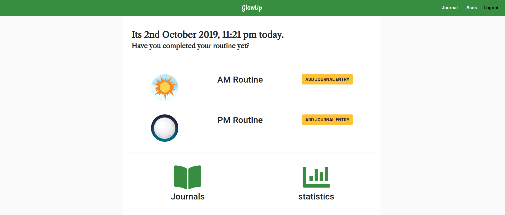

# GlowUp



<b>Url:</b> https://glowupapp.herokuapp.com/

## Objective:
Following skincare can be difficult and tedious. Since there are so many different types of products to multi-step routines, keeping up with a routine can feel like a chore. GlowUp aims to help ease the user to plan out their routines and visualize their progress to encourage them to continue with their routines.

## Functions:
It works as a CRUD(Create, read, update and delete) app with RESTful routes built upon the framework MVC using expressJS and NodeJS. Using React for the front-end and PostgreSQL for the database.

Users can sign up to log their daily skincare routines. Logging how they felt about their skin during the day and night and tracking the progress of their skin's improvement through the use of their previously saved photographs and graphs that visualize their skin's progression.

## Technologies Used:

* **Front-End**
  * React
  * HTML
  * CSS
  * Javascript
* **Back-End**
  * NodeJS
  * ExpressJS
* **Database**
  * PostgreSQL

## Installation Instructions:
1. Installs all the dependencies of the project using </br>
```
npm install
```
2. Create the Postgres db for running on local </br>
```
createdb DATABASE_NAME -U USERNAME
```
3. Creates the tables neccessary to run this project </br>
```
psql -d DATABASE_NAME -U USERNAME -f tables.sql
```
4. Seed dummy data </br>
```
psql -d DATABASE_NAME -U USERNAME -f seed.sql
```
